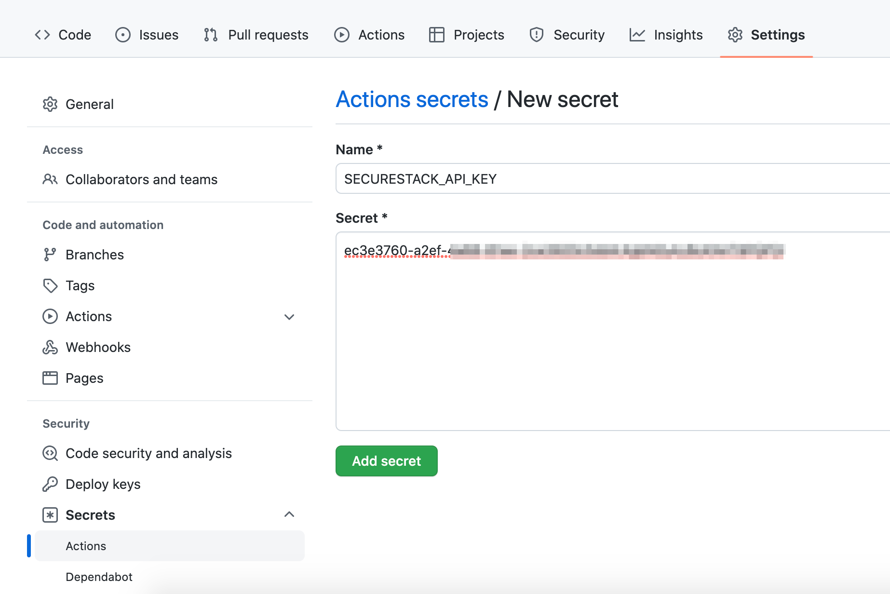
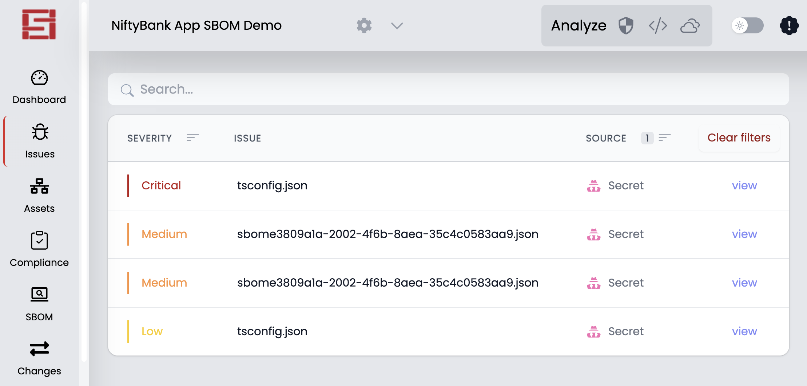

# SecureStack Secrets Analysis GitHub Action

A GitHub Action that analyses your source code for secrets, credentials, API keys, server and database hostnames/URLS, and a lot more!  When you add this to GitHub Actions we will analyze your source code to make sure there is no sensitive data in your commit. See below for the specific types of credentials and files we scan for.

```
name: Example SecureStack Secrets Analysis GitHub Action
on: push
jobs:
  security:
    runs-on: ubuntu-latest
    steps:
      - name: Checkout repo for running secrets analysis within workflow
        id: checkout
        uses: actions/checkout@v2.4.0
        with:
          fetch-depth: 0
      - name: Secrets Analysis Step
        id: secrets
        uses: SecureStackCo/actions-secrets@v0.1.3
        with:
          securestack_api_key: ${{ secrets.SECURESTACK_API_KEY }}
          securestack_app_id: ${{ secrets.SECURESTACK_APP_ID }}
          severity: critical
          flags: '-d 1'

```
NOTE - to understand possible values for the action input `flags`, run the SecureStack cli locally:

`$ bloodhound-cli code --help`

## Create your SecureStack API Key and save as GitHub Secret

1. Log in to [SecureStack](https://app.securestack.com) with your GitHub credentials.
2. Go to Settings in the lower left corner, and then select the 6th tab: API.
3. Generate a new API key and copy the value.
4. Now back in GitHub, go to Settings for your GitHub repository and click on Secrets, and then Actions at the bottom left.
5. Create a new secret named SECURESTACK_API_KEY and paste the value from step 2 into the field and click "Add secret".

## Retreiving your SecureStack Application ID

1. Log in to [SecureStack](https://app.securestack.com).
2. In the application drop down at the top left choose the application you want to use and click on "Copy Application ID" 
3. Create a new secret named SECURESTACK_APP_ID and paste the value from step 2 into the field and click "Add secret".

## What types of credentials does this GitHub Action find?
1. API keys like Stripe, AWS, Amplitude and a bazillion more
2. Server and database hostnames or URLS
3. Passwords and Usernames
4. .env files and git indexes

## How can I see the output of the secrets analysis?
1. You can view the analysis output right in the GitHub Action workflow output
2. You can run a local secrets analysis with our [bloodhound-cli : ](https://app.securestack.com/download-cli)
``` bloodhound-cli code -s -d 1 -a <app_id> ```

3. You can interact with the analysis output in the SecureStack SaaS 

## Check out our other GitHub Actions:
1. [SecureStack Software Composition Analysis (SCA)](https://github.com/marketplace/actions/securestack-application-composition-analysis) - Scan your application for vulnerable third-party and open source libraries.
2. [SecureStack SBOM](https://github.com/marketplace/actions/sbom) - Create a software bill of materials (SBOM) for your application.
3. [SecureStack Web Vulnerability & Cloud Misconfiguration Analysis](https://github.com/marketplace/actions/securestack-web-vulnerability-analysis) - Scan your running application url for cloud misconfigurations and web vulnerabilities.
4. [SecureStack Log4j Analysis](https://github.com/marketplace/actions/securestack-log4j-vulnerability-analysis) - Scan your application for Log4j/Log4Shell vulnerabilities.

## Learn more about SecureStack with our YouTube Channel:
https://www.youtube.com/watch?v=YrPITQNy9UM&list=PL_8Xjyi5rInxzhpQkDRipipmaj0lT6pJ8 

Made with 💜  by [SecureStack](https://securestack.com)
